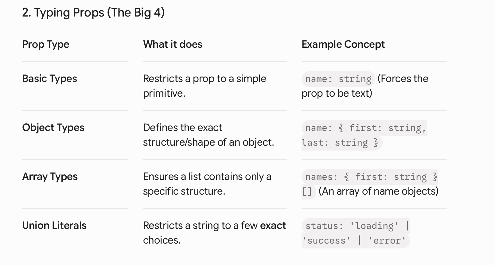

Day 1:


---

## 🛠️ The 6 Essential Prop Patterns


* **Code Pattern:**
  ```typescript
  type BasicProp = {
    name: string;
  };

  type ObjectProp = {
        name: {
            first: string;
            last: string;
        };
    };

    type ArrayProp = {
        names: { 
            first: string; 
            last: string; 
        }[];
    };

    type Status = 'loading' | 'success' | 'error';

    type ChildrenProp = {
        children: string; // Note: fixed typo from 'chidlren'
    };

    type ComponentProp = {
        children: React.ReactNode; // Capitalized 'ReactNode'
    };